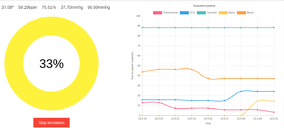

# BSN Server - Body Sensor Network
This system was developed by me during the academic research period in which I worked during the year of 2018. It's most important feature is the synchronization through NodeJs sockets.io library. In that way, every client will be up to date with the same data.

## The research
The research is focused on the simulation of an ICU patient. It is a BSN, a body sensor network, on which relies on a series of wifi sensors attached to a patient. Please, do check our git repository [clicking here](https://github.com/leooleo/bsn). The BSN is connected to this server via socket and it transfers a packet containg all the sensors raw data and each evaluated data(calculed in risk chance wich is provided by the configuration of the BSN).

## What the server does

### Remote configuration
This server is able to remotely configure the BSN, letting the user specify how the data should be generated and each sensor reliability by specifying the accuracy of them. The user will be able to do so by going to the route '/custom'.

### Remote execution
The user will be able to select which configuration needs to be executed. It is possible to select one of the configurations pre-made by the dev's on this project or create one new. On selecting, the user will be redirected to the route '/monitor', which will be used to display the incoming data.

### Monitor
The monitor will display on a circle the patient risk status from 0 to 100%, on 0% meaning all its data are normal and healthy as expected and 100% being all sensors diverge from expected helathy values and it is on extreme risk. The circle shall change its color based on the patient risk. It will be blue until 10%, green until 30%, yellow, 60%, orange, 80% and red afterwards.  
Above, each sensor raw data will be displayed. They are on the order: Thermometer, ECG, Oximeter, and bloodpressure(systolic and dyastolic).  
On the right there is a real-time graph produced using ChartJs. It is responsible to display each sensor risk chance from 0% to 100%. The average of the 5 sensors should provide the patient risk diplayed on the circle.  
Finally, below the circle there is a Stop button, responsible for stopping the execution for all the clients.

To illustrate, please do check this printscreen taken from a simmulation.  



## Instalation & execution
Installation:
```
npm install
```
  
Execution:
```
node server.js
```
